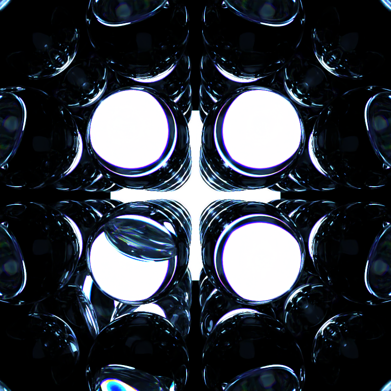
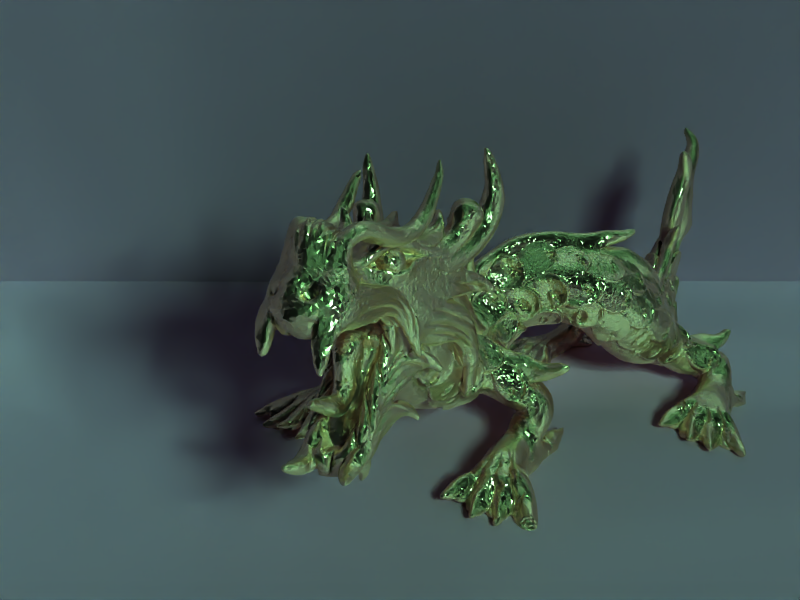
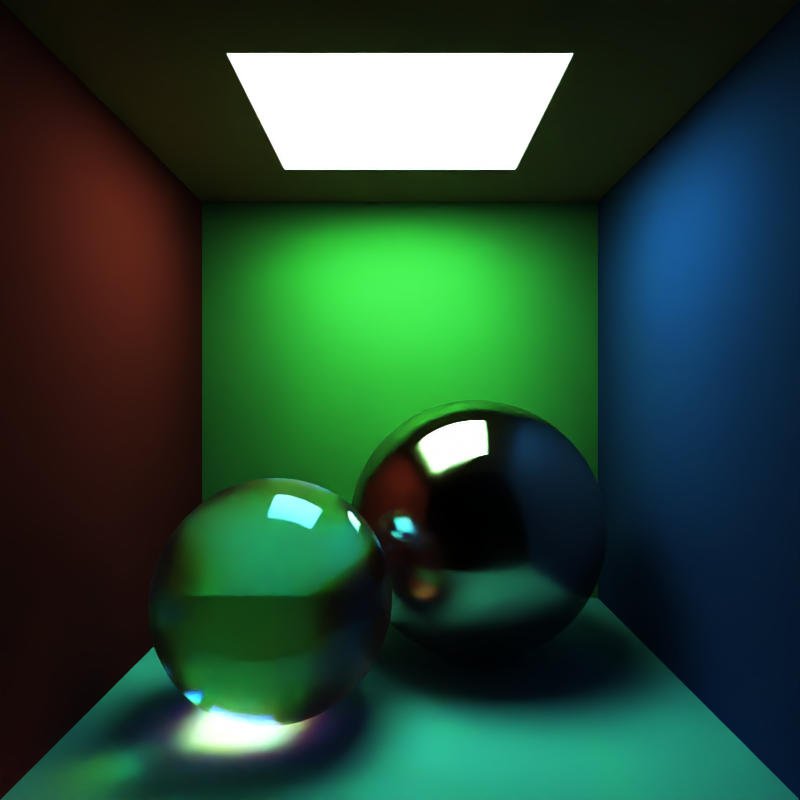

# quetzalcoatlus

This is a hobby raytracer, inspired by the [Raytracing in One Weekend series](https://raytracing.github.io/) and [PBRT](https://pbr-book.org/4ed/contents).

## Sample images

## Required dependencies

- OpenCV
- [Intel OpenImageDenoise 2.1]((https://github.com/OpenImageDenoise/oidn/releases/tag/v2.1.0)) (set CMake configuration variable `OpenImageDenoise_DIR` to `{oidn_install_root}/lib/cmake/OpenImageDenoise-2.1.0`, with the appropriate root dir for your local installation)
- [Intel Embree 4.3](https://github.com/embree/embree/releases/tag/v4.3.0) (set CMake configuration variable `embree_DIR` to `{embree_install_root}/lib/cmake/embree-4.3.0` with the appropriate root dir for your local installation)

You can try using different versions of OIDN and Embree, but 2.1.0 and 4.3.0 are the ones I'm supporting right now.

Boost regex is recommended for importing OBJ files, but compilation will fall back to `std::regex` if boost is not found.
